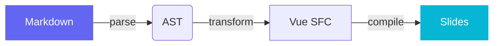
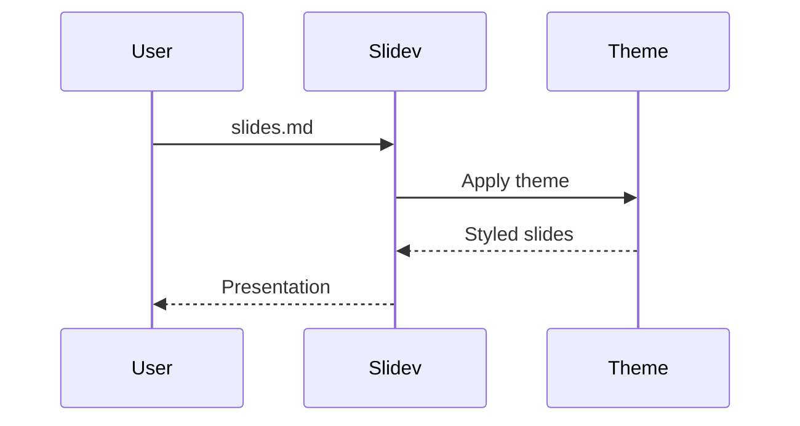

# Aurora Theme

A modern, minimal Slidev theme with animated backgrounds

<div class="pt-12">
  <span @click="$slidev.nav.next" class="px-2 py-1 rounded cursor-pointer" flex="~ justify-center items-center gap-2" hover="bg-white bg-opacity-10">
    Press Space for next page <div class="i-carbon:arrow-right inline-block"/>
  </span>
</div>

---

# What is This Theme?

Aurora is a Slidev theme built for developers who present code, diagrams, and technical content.

- **Animated backgrounds** — gradient blobs shift between slides
- **Light & dark mode** — first-class support for both
- **Themeable** — change primary/secondary colors in frontmatter
- **Multiple layouts** — cover, section, fact, quote, two-cols, image, and more
- **Code-friendly** — clean syntax highlighting with JetBrains Mono
- **Modern CSS** — smooth transitions, subtle grid pattern, noise texture

<br>

> The background subtly animates as you navigate between slides.

---
layout: section
---

# Section Layout

Use this to introduce a new topic

---

# Code Highlighting

TypeScript with line highlighting and TwoSlash hover types

```ts {all|1-3|5-9|11-14|all} twoslash
import { ref, computed, watch } from 'vue'

const slides = ref<string[]>([])

// Reactive computed property
const slideCount = computed(() => slides.value.length)

// Add a slide to the deck
function addSlide(content: string) {
  slides.value.push(content)
}

watch(slideCount, (count) => {
  console.log(`Deck now has ${count} slides`)
})
```

---

# Multiple Languages

<div grid="~ cols-2 gap-6">

```python
# Python example
from dataclasses import dataclass

@dataclass
class Slide:
    title: str
    layout: str = "default"

    def render(self) -> str:
        return f"<h1>{self.title}</h1>"
```

```rust
// Rust example
struct Slide {
    title: String,
    layout: String,
}

impl Slide {
    fn render(&self) -> String {
        format!("<h1>{}</h1>", self.title)
    }
}
```

</div>

---
layout: two-cols
---

# Two Columns

Content flows naturally into two columns. Great for comparing concepts side by side.

- Left column for text
- Bullet points
- Descriptions

::right::

```yaml
# Right column for code
theme: ./
title: My Presentation
themeConfig:
  primary: '#6366f1'
  secondary: '#06b6d4'
```

<br>

Or anything else — images, diagrams, lists.

---
layout: image-right
image: https://images.unsplash.com/photo-1555066931-4365d14bab8c?w=800
---

# Image Right Layout

Perfect for pairing visuals with content.

- Explain a concept
- Show the result
- Clean split layout

The image fills the right half of the slide.

---
layout: quote
---

> The best way to predict the future is to invent it.

Alan Kay

---
layout: fact
---

# 60fps

Smooth animations powered by CSS transitions

---
layout: statement
---

# Themes should get out of the way and let your content shine

---

# Diagrams

Mermaid diagrams render beautifully in both light and dark mode.

<div class="grid grid-cols-2 gap-8 pt-4">





</div>

---

# Math & LaTeX

Inline math: $E = mc^2$ and $\nabla \cdot \vec{E} = \frac{\rho}{\epsilon_0}$

Block equations:

$$
\int_{-\infty}^{\infty} e^{-x^2} dx = \sqrt{\pi}
$$

$$
f(x) = \sum_{n=0}^{\infty} \frac{f^{(n)}(a)}{n!}(x-a)^n
$$

---

# Tables

| Feature | Light Mode | Dark Mode |
|---------|-----------|-----------|
| Background | Soft white with gradient blobs | Deep navy with gradient blobs |
| Code blocks | Light gray surface | Dark navy surface |
| Text | High contrast dark | Soft white |
| Accents | Vibrant primary/secondary | Same, slightly muted |

---

# Theming

Override the default colors in your frontmatter:

```yaml
---
themeConfig:
  primary: '#e11d48'    # Rose
  secondary: '#7c3aed'  # Violet
---
```

Available CSS variables:

| Variable | Default | Purpose |
|----------|---------|---------|
| `--slidev-theme-primary` | `#6366f1` | Headings, accents, links |
| `--slidev-theme-secondary` | `#06b6d4` | Gradients, decorations |
| `--slidev-theme-accent` | `#f59e0b` | Third blob color |

---
transition: glow
---

# Transitions

This theme includes two custom transitions:

**`morph`** (default) — slides shift vertically with a subtle blur

**`glow`** — slides scale with a brightness glow effect

Set per-slide or globally:

```yaml
---
transition: glow    # per-slide
---
```

```yaml
---
transition: morph   # global default in frontmatter
---
```

---
layout: center
class: text-center
---

# Get Started

Use this theme in your project:

```yaml
---
theme: ./path/to/theme
---
```

[Slidev Documentation](https://sli.dev) · [GitHub](https://github.com/slidevjs/slidev)
