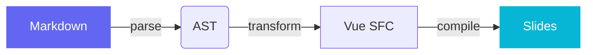
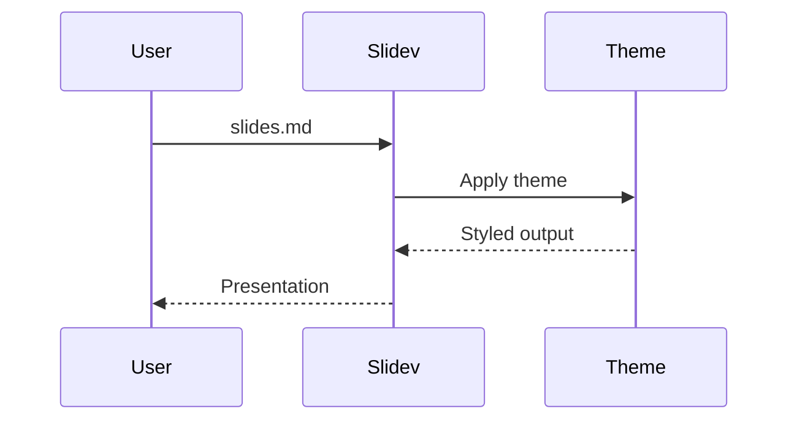

# Aurora

A presentation theme for developers

---

# What is Aurora?

An editorial-inspired Slidev theme that blends atmospheric gradients, frosted glass, and bold serif typography into a clean developer presentation system.

- **Atmospheric backgrounds** — radial gradient blooms shift per slide
- **Editorial typography** — Instrument Serif display, Archivo body
- **Frosted glass** — translucent panels with backdrop blur
- **Themeable** — change primary, secondary, and accent colors
- **Light & dark** — full support for both modes
- **Hairline rules** — clean 1px separators, no heavy borders

---
layout: section
---

# Code & Syntax

---

# TypeScript

Syntax highlighting with line stepping and TwoSlash hover types.

```ts {all|1-2|4-8|10-13|all} twoslash
import { ref, computed } from 'vue'

// Reactive state
const slides = ref<string[]>([])
const count = computed(() => slides.value.length)

function addSlide(content: string) {
  slides.value.push(content)
}

// Template literal types
type SlideLayout = `layout-${'cover' | 'default' | 'section'}`
type Route = `/${string}`
```

---

# Multiple Languages

<div grid="~ cols-2 gap-6">

```python
from dataclasses import dataclass
from typing import Optional

@dataclass
class Slide:
    title: str
    layout: str = "default"
    notes: Optional[str] = None

    def render(self) -> str:
        return f"<h1>{self.title}</h1>"
```

```rust
#[derive(Debug)]
struct Slide {
    title: String,
    layout: String,
}

impl Slide {
    fn new(title: &str) -> Self {
        Self {
            title: title.into(),
            layout: "default".into(),
        }
    }
}
```

</div>

---
layout: two-cols
---

# Two Columns

Content flows into two columns, separated by generous spacing. Ideal for comparing concepts or pairing text with code.

- Left column for explanation
- Numbered steps or bullet points
- Descriptive prose

::right::

<div class="glass mt-4">

```yaml
# Theme configuration
theme: ./
themeConfig:
  primary: '#6366f1'
  secondary: '#06b6d4'
  accent: '#f59e0b'
```

</div>

<p class="micro-label mt-6">Configuration</p>

Override any color in your frontmatter to completely retheme the presentation.

---
layout: image-right
image: https://images.unsplash.com/photo-1555066931-4365d14bab8c?w=800
---

# Image Right

Pair visuals with content. The image fills the right half while your text gets generous editorial padding on the left.

- Explain the concept
- Show the result
- Clean split layout

Works with any image URL or local path.

---
layout: quote
---

> The best way to predict the future is to invent it.

Alan Kay

---
layout: fact
---

# 60fps

Smooth transitions between every slide

---
layout: statement
---

# Themes should get out of the way and let your content shine

---

# Diagrams

Mermaid renders cleanly in both modes.

<div class="grid grid-cols-2 gap-8 pt-4">





</div>

---

# Mathematics

Inline math: $E = mc^2$ and $\nabla \cdot \vec{E} = \frac{\rho}{\epsilon_0}$

Block equations with step-through:

$$ {1|2|all}
\int_{-\infty}^{\infty} e^{-x^2}\, dx = \sqrt{\pi}
$$

$$
f(x) = \sum_{n=0}^{\infty} \frac{f^{(n)}(a)}{n!}(x-a)^n
$$

---

# Tables

Hairline-rule separators keep tables clean and readable.

| Feature | Light Mode | Dark Mode |
|---------|-----------|-----------|
| Background | Warm parchment with gradient blooms | Deep navy with gradient blooms |
| Code blocks | Frosted glass on light surface | Frosted glass on dark surface |
| Typography | Instrument Serif display, dark ink | Instrument Serif display, light ink |
| Accents | Vibrant primary/secondary gradients | Same palette, adjusted opacity |

---
layout: section
---

# Charts & Data

---
layout: two-cols
---

# Bar Chart

Grouped bar chart built with Unovis + shadcn-vue chart components. Fully themed, with tooltips on hover.

<p class="micro-label mt-4">Dependencies</p>

```bash
bun add @unovis/ts @unovis/vue reka-ui
```

Chart colors adapt to light/dark mode via `--chart-1` through `--chart-5` CSS variables.

::right::

<DemoBarChart class="mt-8" />

---
layout: two-cols
---

# Line Chart

Multi-series line chart with smooth monotone curves. Hover for crosshair tooltips.

<p class="micro-label mt-4">Usage</p>

```vue
<script setup>
import { VisLine, VisXYContainer } from '@unovis/vue'
import { ChartContainer } from './ui/chart'
</script>

<template>
  <ChartContainer :config="chartConfig">
    <VisXYContainer :data="data">
      <VisLine :x="xFn" :y="yFn" />
    </VisXYContainer>
  </ChartContainer>
</template>
```

::right::

<DemoLineChart class="mt-8" />

---
transition: glow
---

# Theming

<div class="grid grid-cols-2 gap-8">
<div>

Override the default palette in your frontmatter:

```yaml
---
themeConfig:
  primary: '#e11d48'
  secondary: '#7c3aed'
  accent: '#f59e0b'
---
```

The entire theme — blooms, gradients, accents, links, code highlights — adapts to your colors.

</div>
<div>

<p class="micro-label mb-4">CSS Variables</p>

| Variable | Default |
|----------|---------|
| `--slidev-theme-primary` | `#6366f1` |
| `--slidev-theme-secondary` | `#06b6d4` |
| `--slidev-theme-accent` | `#f59e0b` |

<p class="micro-label mt-6 mb-4">Transitions</p>

**`morph`** — vertical shift with subtle blur<br>
**`glow`** — scale with brightness bloom

</div>
</div>

---
layout: end
---

# Thank you

[Slidev Documentation](https://sli.dev) · [GitHub](https://github.com/slidevjs/slidev)
